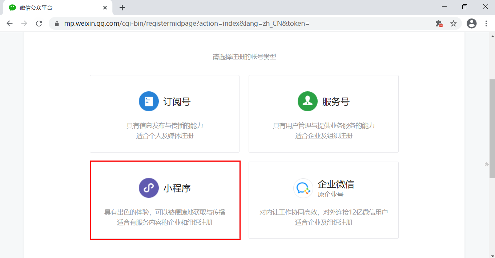

# 微信小程序 - `Unit01`

# 1.`ECharts`

## 1.1 `echarts.init()`方法

`echarts.init()`方法用于创建图表实例，其语法结构是：

```javascript

variable = echarts.init(HTMLDivElement|HTMLCanvasElement[,theme[,options]])

```

> `theme`用于指定图表使用的主题
>
> ​	主题的下载地址：https://echarts.apache.org/zh/download-theme.html
>
> ​	自定义主题地址：https://echarts.apache.org/zh/theme-builder.html
>
> `options`用于指定图表的相关选项，为`object` 类型，包括：
>
> `renderer`，指图表的渲染引擎，可以为`canvas`或`svg`

## 1.2 配置项

```javascript

instance.setOption({...});

```

### · `title`组件

`title`用于对标题进行配置，其语法结构是：

```javascript

title:{
	text:"主标题文本",
    link:"主标题链接",
    target:"打开主标题链接的窗口形式(blank|self)",
    textStyle:{
        color:"颜色",
        fontFamily:"字体列表,...",
        fontSize:字号(number),
        fontWeight:"bold|100|...900(string|number)",
        fontStyle:"noraml|italic",
        lineHeight:行高(number)
    },
    subtext:"副标题文本",
    sublink:"副标题链接",
    subtarget:"打开副标题链接的窗口形式(blank|self)",
    subtextStyle:{
        color:"颜色",
        fontFamily:"字体列表,...",
        fontSize:字号(number),
        fontWeight:"bold|100|...900(string|number)",
        fontStyle:"noraml|italic",
        lineHeight:行高(number)
    },
    top:标题组件距容器顶部的距离(number|string(top|middle|bottom)),
    right:标题组件距容器右侧的距离(number|string(left|center|right)),
    bottom:标题组件距容器底部的距离(number|string(top|middle|bottom))
    left:标题组件距容器左侧的距离(number|string(left|center|right))
    
}

```

## · `xAxis`组件

`xAxis`组件用于对`X`轴进行配置。

```javascript

xAxis:{
    type:"category(类目轴)",
    //data中的数据可以为string array | object array
    data:[]
}


```

# 2.微信小程序

## 2.1 微信公众平台

微信公众平台是由腾讯提供的，基于腾讯的微信服务器，为广大的企业、组织或个人提供用户管理或咨讯服务的平台。

微信公众平台提供的账号类型有：

· 服务号，为企业或组织提供的进行用户的管理和服务，侧重于服务，类似于`114`，如中国移动、中国联通等。

· 订阅号，为企业、组织或个人提供一种全新的消息传播方式，类似于免费的报刊，如`CSDN`、前端大全、达内教育等。

· 小程序，为企业、组织或个人提供的可以达到与原生`APP`相同功能的应用，其优点在于用完即走

微信公众平台的官网: https://mp.weixin.qq.com

## 2.2 小程序的接入流程

A.在微信公众平台注册开发者账号




B.填写注册信息


C.填写用户登记信息


## 2.3 创建小程序项目


## 2.4 小程序的文件组成

小程序的文件类型有：

· `.json`，配置文件

​	`app.json`，全局配置

​	`page.json`，页面配置，其优先级高于全局配置

· `.wxml`，模板文件，其类似于网页开发中的`HTML`，但不能使用任何的`HTML`标签，只能使用小程序专用的组件。

· `.wxss`，样式文件，其类似于网页开发中的`CSS`

​	`app.wxss`，全局样式

​	`page.wxss`，页面样式，其优先级高于全局样式

· `.js`，脚本文件

​	`app.js`，小程序的入口脚本文件

​	`page.js`，页面的脚本文件

> `app.json`、`app.wxss`、`app.js`文件必须存储在小程序的根目录下

## 2.5 `app.json`

`app.json`用于对小程序进行全局配置。

> `JSON`文件不能书写注释
>
> 字符串必须括在英文双引号之间
>
> 数组中最后一个成员后不能存在逗号
>
> `JSON`中不能存在`undefined`数据类型

### · `pages`属性

`pages`属性用于指定小程序由哪些页面组成，每个页面由`.json`、`.wxml`、`.wxss`和`.js`组成

> `pages`的数据类型为`array`
>
> 默认情况下，数组中的第一项代表小程序的初始页面 -- 首页

```json

{
    "pages":[
        "pages/index/index",
        "pages/me/me",
        "pages/logs/logs"
    ]
}

```

### · `window`属性

`window`属性用于设置小程序导航栏、标题、窗口背景颜色等信息，`object`类型

```json

{
    "window":{
		"navigationBarTitleText":"标题文本",
        "navigationBarTextStyle":"标题文本颜色(white|black)",
        "navigationBarBackgroundColor":"标题栏背景颜色",
        "enablePullDownRefresh":true|false,
        "backgroundTextStyle":"下拉刷新loading的样式(light|dark)",
        "backgroundColor":"窗口的背景颜色"
    }
}


```

### · `tabBar`属性

`tabBar`属性用于配置小程序底部的选项卡，`object`类型

```json

{
    "tabBar":{
        "postion":"选项卡的位置(top|bottom)",
        "color":"文本正常显示的颜色",
        "selectedColor":"文本被选中时的颜色",
        "backgroundColor":"底部选项卡的背景颜色",
        "borderStyle":"选项卡上边框的颜色(black|white)",
        "list":[
            {
              "text":"文本内容",
              "pagePath":"页面的路径",
              "iconPath":"正常显示时的图片路径",
              "selectedIconPath":"被选中时的图片路径"
            }
        ]
    }
}


```

> 如果`position`属性值为`top`的话，无法显示图标
>
> `list` 中至少包含`2`个，至`5`个选项卡
>
> `pagePath`不能以`/`开头
>
> `iconPath`和`selectedIconPath`不能使用网络路径
>
> 图片尺寸建议为`81x81`，字节数不能超过`40KB`

### · `style`属性

`style`属性用于指定样式，目前值仅为`v2`(要求基础库版本`>=2.8`)，`string`类型

### · `siteMapLocation`属性

`siteMapLocation`属性用于指定`sitemap.json`文件的位置，`string`类型

## 2.6 `sitemap.json`

`sitemap.json`用于制定爬虫的搜索规则，其基本结构是：

```json

{
	"rules":[
		{
           "action":"动作类型(allow|disallow)",
           "page":"页面路径",
           "params":["路径参数1","路径参数2"],
           "matching":"匹配规则(exact|inclusive|exclusive|partial)"
        }
	]
}


```

> 路径参数指`pages/article/article?cid=6&order=time`中的`cid`和`order`
>
> `matching`的规则包括：
>
> `exact`，完全相同
>
> `inclusive`，包含
>
> `exclusive`，不包含
>
> `partial`,部分包含

可在`project.config.json` 的`setting`中添加`checkSiteMap`:`false`语句

# 3.组件

## · 关于组件属性

A.小程序中的组件既遵守驼峰标记法，也遵守短横线分隔法

B.布尔类型的数据无论其值为多少，结果都认为是`true`，除非该属性不存在；动态属性时只能使用`true`或`false`来表示。

## · `<view>`组件

`<view>`组件为视图容器组件，其语法结构是：

```html

<view
	hover-class="按下去的WXSS样式类名称"
    hover-start-time="多久后出现点击状(50)"
    hover-stay-time="点击状保持的时长(400)"
    hover-stop-propagation="是否阻止冒泡">
    ...
</view>


```

课外作业：

预习`image`、`swiper`、`scroll-view`、`input`、`slider`等

下周四(2020年12月24日)下午18点之前完成小程序基本信息的填写