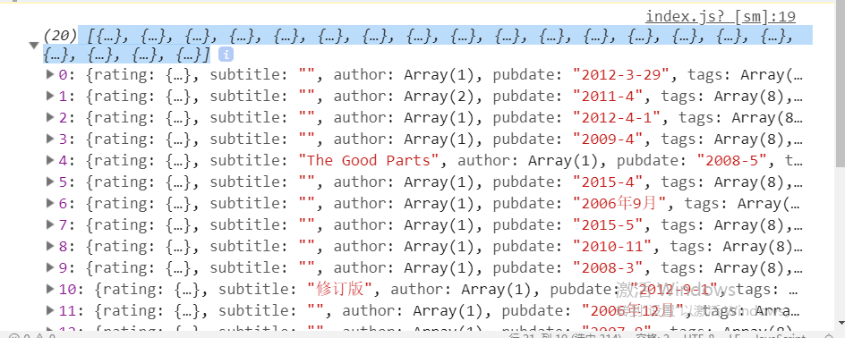

# 微信小程序 - `Uni04`

# 1.微信小程序的生命周期

## 1.1  微信小程序的生命周期

微信小程序的生命周期的钩子函数存在于`app.js`文件内。

· `onLaunch`钩子函数在小程序初始化完成时自动调用，只触发一次，其语法结构是：

```javascript
App({
	onLaunch(){
        //....
    }
})


```

· `onShow`钩子函数在小程序启动显示时或切换到前台时触发，其语法结构是

```：javascript
App({
	onShow(){
		//....
	}
})

```

· `onHide`钩子函数在小程序切换到后台时触发，其语法结构是：

```javascript
App({
	onHide(){
		//....
	}
})

```

## 1.2 页面的生命周期

页面的生命周期的钩子函数存在于`page.js`文件内。

· `onLoad()`钩子函数在页面加载时被执行，其语法结构是：

```javascript

Page({
	onLoad(options){
		//....
	}
})

```

> `options` 参数代表`URL`地址栏参数所形成的对象！
>
> `onLoad`钩子函数只被执行一次

· `onShow()`钩子函数在页面显示/切换到前台时执行，其语法结构是：

```javascript

Page({
	onShow(){
		//....
	}
})

```

· `onReady()`钩子函数在页面初次渲染完成时执行，代表页面已经准备完成，可以与视图层进行交互，其语法结构是：

```javascript

Page({
	onReady(){
		//....
	}
})

```

·  `onUnload()`钩子函数在页面卸载时执行，其语法结构是：

```javascript

Page({
	onUnload(){
		//...
	}
})

```


## 1.3 页面导航

页面跳转可以通过以两种方式实现：

第一种：可以通过`<navigator>`组件实现，`<navigator>`组件的语法结构是：

```html

<navigator url="当前小程序页面组件的地址" open-type="打开方式">...</navigator>

```

> `open-type`属性包括：
>
> `switchTab`,跳转到 `tabBar` 页面，并关闭其他所有非 `tabBar` 页面
>
> `redirect`，关闭**当前**页面，跳转到应用内的某个页面
>
> `reLaunch`,关闭**所有**页面 ,跳转到应用内的某个页面
>
> `navigate`，普通的链接，保留当前页面，然后跳转到应用内的某个页面

第二种：通过微信小程序`API`实现

> `wx.navigateTo()`方法（与`<navigator>`中`open-type="navigate"`等效）
>
> ```javascript
> 
> wx.navigateTo({
> 	url:"当前小程序的页面组件路径",
> 	success:()=>{
> 		//成功时的回调函数
> 	},
> 	fail:()=>{
> 		//失败时的回调函数
> 	},
> 	complete:()=>{
> 		//完成时的回调函数(无论success还是fail都会执行)
> 	}
> })
> 
> 
> ```
>
> `wx.switchTab()`方法（与`<navigator>`中`open-type="switchTab"`等效）
>
> ```javascript
> 
> wx.switchTab({
> 	url:"当前小程序的页面组件路径",
> 	success:()=>{
> 		//成功时的回调函数
> 	},
> 	fail:()=>{
> 		//失败时的回调函数
> 	},
> 	complete:()=>{
> 		//完成时的回调函数(无论success还是fail都会执行)
> 	}
> })
> 
> ```
>
> `wx.redirectTo()`方法（与`<navigator>`中`open-type="redirect"`等效）
>
> `wx.reLaunch()`方法（与`<navigator>`中`open-type="reLaunch"`等效）

# 2.异步请求

## 2.1微信小程序访问外部数据的限制

A.域名只支持`HTTPS`协议

B.域名必须经过`ICP`备份

C.域名不能为本地 `IP`地址

D.每个小程序最多可以配置`20`个域名

## 2.2 服务器域名的配置

A.微信小程序后台 --> 开发 --> 开发设置 --> 服务器域名


B.进行域名的配置


C.查看开发者工具是否正常启用配置的域名


## 2.3 `wx.request()`方法

`wx.request()`方法用于执行`HTTPS`请求，其语法结构是：

```javascript

wx.request({
	url:"URL地址",
    data:"请求参数(string|object)",
    method:"请求方式(GET|POST|PUT|DELETE)",
    header:{
        //HTTP请求头
        //默认的content-type为application/json
    },
    success:(res)=>{
        //成功时的回调函数
    },
    fail:()=>{
        //失败时的回调函数
    },
	complete:()=>{
        //完成时的回调函数
    }
})

```

## 2.4  豆瓣图书API说明

豆瓣图书的搜索`API`:

https://api.douban.com/v2/book/search?q=javascript&apikey=0df993c66c0c636e29ecbb5344252a4a

`q`参数用于指定搜索的关键字

`start`参数用于指定从第几条记录开始返回，从0开始编号

`count`参数用于指定返回的记录数量，默认为20

返回的结果包含：

- `start`：从第几条开始记录开始返回，默认为`0`
- `count`：返回的记录数量，默认为0
- `total`，返回记录的总量，也就是搜索的图书总数
- `books`，用于存放搜索到的图书结果，为`array`类型
- 每本搜索到的图书对象包含以下信息：
  - `title`，图书名称
  - `price`，图书价格
  - `pubdate`，图书出版日期
  - `publisher`，出版社名称
  - `id`,图书的`ID`
  - `image`，图书的封面图片
  - `images`，图书的封面图片对象，包含`small(小图地址)`、`medium(中等图地址)`、`large(大图地址)`

## 2.5 学子书院项目实现

第一步：在首页加载完成后，就应该向豆瓣图书发送异步的请求，以获取图书信息  -- 微信小程序生命周期的钩子函数  -- `page`的`onLoad()`，示例代码如下：

```javascript
Page({
	onLoad(options){
		 wx.request({
        url:'https://api.douban.com/v2/book/search?q=javascript&apikey=0df993c66c0c636e29ecbb5344252a4a',
        method:'get',
        header:{
          'content-type':'application/x-www-form-urlencoded'
        },
        success:res=>{
            console.log(res.data.books);
        }
      });
	}
})

```

此时调试器的运行结果如下:



第二步：将服务器返回的结果存储到`data`的变量内，示例代码如下：

``` javascript

data:{
	books:[]
}

```

同时将服务器返回的结果存储到`books`变量中，示例代码如下:

```javascript
...
success:res=>{
	this.setData({
		books:res.data.books
	})
}
...

```

第三步：在`wxml`文件内遍历`data`中的变量，以输出图书的相关信息，示例代码如下：

```html

<view wx:for="{{books}}" wx:key="index">
	....
</view>

```

第四步：现在应该为列表中的每一本图书添加链接，以查看图书的详细信息，所以：

A.创建`detail`的页面组件

B.在首页的列表中为图书添加链接 --- `<navigator>`组件，同时为链接添加`URL`

参数，以表明当前图书的`ID`,示例代码如下：

```html

<navigator url="/pages/detail/detail?id={{item.id}}">
    ...
</navigator>

```

现在已经将`id`参数通过URL地址栏传递到了`/pages/detail/detail`页面，现在必须在该页面中接收该参数 -- 在哪个生命周期钩子函数中实现? -- `onLoad`

```javascript

Page({
	onLoad(options){
		let id = options.id;
	}
})

```

而且现在要以`id`为条件，发送异步请求到豆瓣图书的API地址，所以代码修改如下：

```javascript

Page({
    data:{
        //存储图书信息
        info:{}
    },
	onLoad(options){
		let id = options.id;
       	wx.request({
       url: 'https://api.douban.com/v2/book/' + id + '?apikey=0df993c66c0c636e29ecbb5344252a4a',
       method:'GET',
       header:{
         'content-type':'application/x-www-form-urlencoded'
       },
       success:res=>{
          //console.log(res);
          this.setData({
            info:res.data
          });
       }
     });
	}
})

```

