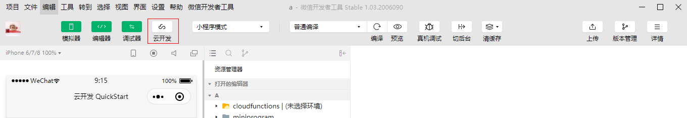
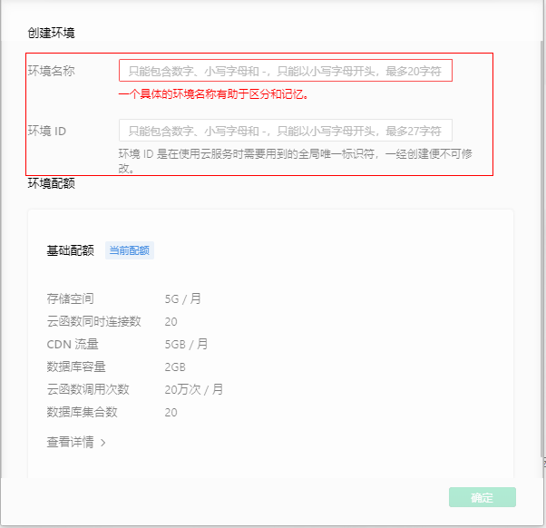
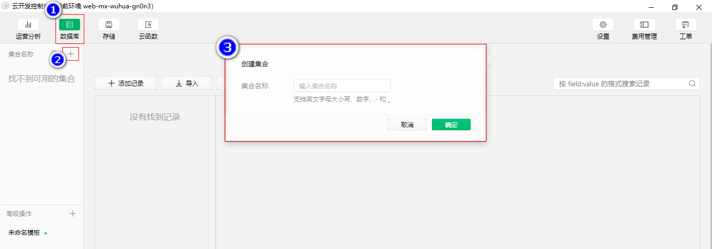
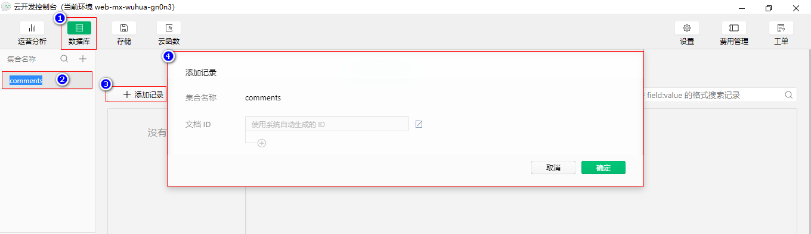
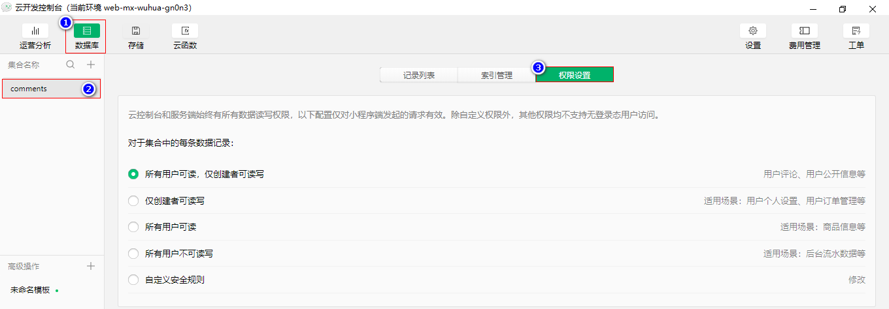

# 微信小程序 -- `Unit06`

# 1.微信小程序云开发

## 1.1 概述

微信小程序云开发包含的服务类型有：

- 云存储，类似于网盘，可以存储任意类型的文件，如图像，音频、视频等。
- 云数据库，是一个专门为微信小程序提供的`JSON`类型的数据库。
- 云函数，实现更为复杂的服务器扩展功能。

## 1.2 开通云服务

A.单击工具栏中的"云开发"按钮



B.在弹出的对话框中输入云环境名称及`ID`



> 每个微信小程序只能开通两个云服务
>
> 每个微信小程序只能使用与自己关联的云服务
>
> 微信小程序的云服务的前缀为 `cloud://`

# 2.云存储

云存储内的文件可以通过以下两种方式进行管理：

A.云开发控制台

B.通过`API` 实现

## 2.1 云开发控制台管理文件

通过云开发控制台的图形化管理界面实现即可。

## 2.2 通过`API` 实现

· `wx.chooseImage()`方法

`wx.chooseImage()`方法用于从本地相册选择图片或使用相机拍照，其语法结构是：

```javascript

wx.chooseImage({
	count:最多选择的图片数量(最多为9张),
    sourceType:"图片源类型['album', 'camera']",
    success:res=>{
        //成功时的回调函数
    },
    fail:()=>{
        //失败时的回调函数
    },
    complete:()=>{
        //完成时的回调函数
    }
});


```

> `success`回调函数中返回选择的图片文件信息，包括：
>
> `tempFiles`，数组对象，形如：
>
> ```javascript
> [
> 	{	
>         //临时文件的路径及名称
> 		path: "wxfile://tmp_904bf3e59d5dba95eb67180980f5551f.jpg",
>         //图像文件的字节数
>         size:88369
> 	},
> 	{
> 		path: "wxfile://tmp_904bf3e59d5dba95eb67180980f5551f.jpg",
>         size:88369
> 	}
> ]
> 
> ```
>
> `tempFilePaths`，包含了选择的图片文件的路径，数组类型

· `wx.chooseVideo()`方法

`wx.chooseVideo()`方法用于拍摄视频或从手机相册中选视频，语法结构是：


· `wx.chooseMedia()`方法

`wx.chooseMedia()`方法用于拍摄或从手机相册中选择图片或视频，语法结构是：

· `wx.uploadFile()`方法


· `wx.cloud.uploadFile()`方法

`wx.cloud.uploadFile()`将文件上传到云存储空间内，其语法结构是：

```javascript

wx.cloud.uplOadFile({
	filePath:"上传文件的路径"
	cloudPath:"云存储路径"
	success:res=>{
		//成功时的回调函数
	}
})

```

> `success`回调函数将返回上传文件的`fileID`

# 3.云数据库

## 3.1 概述

云数据库是微信小程序提供的`JSON`类型数据库。

`JSON`数据类型的数据库是基于`MongoDB` -- 非关系型数据库(`NoSQL` -- `Not Only SQL`)

## 3.2 关系型数据库与非关系型数据库的区别

|            | 关系型                                                       | 非关系型                                                     |
| ---------- | ------------------------------------------------------------ | ------------------------------------------------------------ |
| 数据类型   | 整型、浮点型、定点型、字符型等                               | 字符型、数值型、数组、对象等                                 |
| 核心概念   | 数据库(`Database`)->数据表(`Table`)->列(`Column`)->行(`Row`) | 数据库(`Database`)->集合(`Collection`)->字段(`field`)->记 录(`Record`)/文档(`Document`) |
| 操作命令   | 统一使用`SQL`命令，存在差别<br />`SQL Server`=>`T-SQL`<br />`Oracle`=>`PL/SQL` | 不尽相同                                                     |
| 关系的维护 | 通过外键来维护                                               | 不存在关系的概念                                             |
| 记录的结构 | `id`    `username`  `fId`        1       `Tom`           5<br />2        `Rose`        9 | {<br />id:5,<br />username:"Rose"<br />firend:{<br />username:"Frank"<br />sex:true<br />}<br />} |

## 3.3 云数据库的使用

云数据库的使用可通过以下两种方式实现：

A.通过云开发控制台的图形化管理界面

B.通过云数据库的`API`实现

## 3.4 通过云开发控制台管理

A.创建集合



B.根据需要添加记录



C.设置集合的访问权限



## 3.5 通过云数据库的`API`实现

### · `wx.cloud.database()`方法

`wx.cloud.database()`方法用于实现数据库的连接，其语法结构是：

```javascript

Database wx.cloud.database()

```

> 该方法返回数据库对象

### · `Database`对象

· `collection()`方法

`collection()`方法用于返回对指定集合的引用，其语法结构是：

```javascript

Collection Database对象.collection('集合名称')

```

· `command` 属性

`command`属性用于返回数据库运算符对象，其语法结构是:

```javascript

Command Database对象.command

```

### · `Collection`对象

· `add()`方法

`add()`方法用于插入记录，其语法结构是：

```javascript

Collection对象.add({data:{....}})

```

> `_id`字段是由微信小程序生成的保证记录唯一性的`id`
>
> `_openid`字段用于标识记录的所有者

· `field()`方法

`field()`方法用于指定查询的字段，其语法结构是：

```javascript

Collection Collection对象.field({key:true|false})

```

示例代码如下：

```javascript

collect.field({
    username:true,
    age:true,
    _id:false,
    "friends.username":true          
}).get({
    success:res=>{
        console.log(res);
    }
});

```

· `where()`方法

`where()`方法用于指定查询的条件，其语法结构是：

```javascript

Collection Collection对象.where({
	字段名称:数据库运算符对象
})

```

· `orderBy()`方法

`orderBy()`方法用于对数据进行排序，其语法结构是：

```javascript

Collection Collection对象.orderBy(field,'asc|desc')

```

> `asc`为升序，`desc`为降序
>
> 如果需要对嵌套字段排序，需要用 "点表示法" 连接嵌套字段，比如 `style.color` 表示字段 `style` 里的嵌套字段 `color`。

· `skip()`方法

`skip()`方法用于指定从第几条记录开始返回，其语法结构是：

```javascript

Collection Collection对象.skip(数字)

```

> 记录的编号从`0`开始

· `limit()`方法

`limit()`方法用于指定返回几条记录，其语法结构是：

```javascript

Collection Collection对象.limit(数字)

```

· `get()`方法

`get()`方法用于获取集合数据，其语法结构是：

```

Collection对象.get({
	success:res=>{
	
	},
	fail:()=>{
	
	}
})

或者

Collection对象.get().then(res=>{

}).catch(err=>{

})


```

