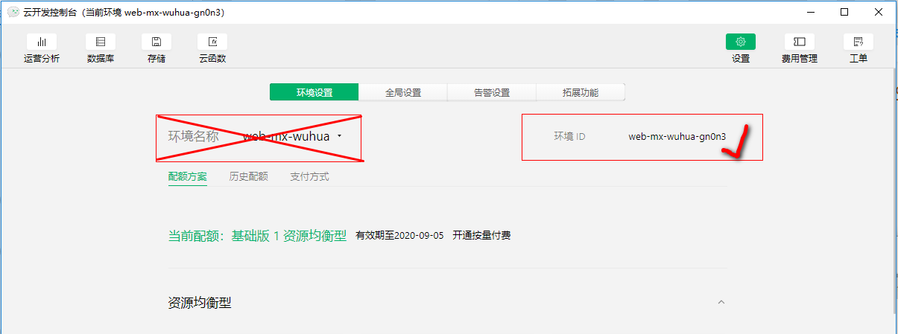
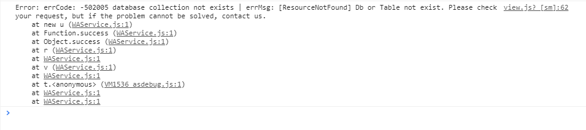
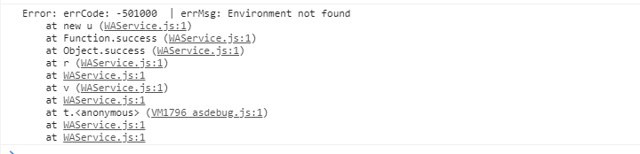
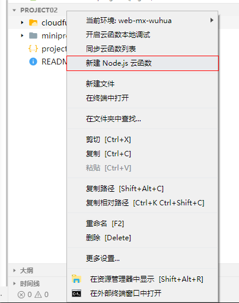
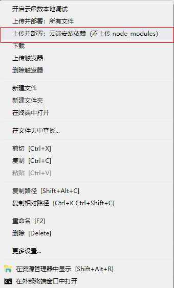

# 微信小程序 -- `Unit07`

# 1.云数据库

## · `Collection`对象

· `update()`方法

`update()`方法用于实现记录的更新，其语法结构是：

```javascript

Collection对象.update({
	data:{...},
	success:res=>{
		//res.stats.updated返回被更新的记录数量
	}
})

```

> 在微信小程序基础库版本`<=2.10`时，禁止通过微信小程序客户端对数据进行修改
>
> 在微信小程序基础库版本`>2.10`对记录进行更新时，必须指定条件表达式

· `remove()`方法

`remove()`用于删除多条记录，其语法结构是：

```javascript

Collecion.remove({
	success:res=>{
		//res.stats.removed返回被删除的记录数量
	}
})

```

> 在微信小程序基础库版本`>2.10`对记录进行更新时，必须指定条件表达式
>
> 在微信小程序客户端只能删除一条记录，但如果通过云函数删除的话，可以删除多条记录。

· `doc()`方法

`doc()`方法用于按`_id`进行记录的查找，其语法结构是：

```javascript


Document Collection对象.doc('id')

```

`count()`方法

`count()`方法用于返回结果中的记录数量，共语法结构是：

```

Collection对象.count({
	success:res=>{
		//res.total返回结果中包含的记录数量
	}
})


```

## · `Document`  对象

· `get()`方法

`get()`方法用于获取记录数据，其语法结构是：

```javascript

Document对象.get({
	success:res=>{
		//...
	}
})

```

· `remove()`方法

`remove()`方法用于删除指定的记录，其语法结构是：

```javascript

Document对象.remove({
	success:res=>{
		//res.stats.removed，返回被删除的记录数量
	}
})

```

· `set()`方法

`set()`方法用于完成替换更新，其语法结构是：

```javascript

Document对象.set({
	data:{
		//....
	},
	success:res=>{
		//res.stats.created返回新创建的记录数量
        //res.stats.updated返回被更新的记录数量        
	}
})

```

> `set()`只保留`data`属性指定的字段，其他字段均被删除
>
> 在通过`set()`方法进行替换更新操作时，如果记录对象不存在，则产生添加；如果存在则产生替换。

· `update()`方法

`update()`方法用于完成记录的更新，其语法结构是：

```javascript


Document对象.update({
	data:{
		//....
	},
	success:res=>{
		//res.stats.updated返回被更新的记录数量   
	}
})

```

> `update()`方法只更新指定的字段

## ·  `wx.cloud.init()`

`wx.cloud.init()`方法用于实现云环境的初始化，全局只需要调用一次即可，其语法结构如下：

```javascript

wx.cloud.init({
	env:"云环境ID",
	traceUser:是否跟踪用户
})


```

> 配置云环境的`wx.cloud.init()`方法建议写在`app.js`中的`onLaunch`钩子函数中
>
> 其实可以在`wx.cloud.database()`方法指定云环境`ID`，如果没有指定的话，则使用`wx.cloud.init()`方法指定的环境`ID`，`wx.cloud.database()`的方法结构是：
>
> ```javascript
> 
> Database wx.cloud.database({
> 	env:"云环境ID"
> })
> 
> ```





出现以上错误的原因是：

A.集合不存在或者集合名称书写错误

B.指定集合不在当前云环境内  --  在`wx.cloud.database()`方法中指定云环境ID即可



上图所示的错误原因是：环境`ID`不存在或环境`ID`书写错误

# 2.云函数

云函数实质就是在腾讯云服务器上运行的、针对微信小程序的自定义函数。

## 2.1 创建云函数

A. 鼠标右击`"CloudFunctions"`，然后从弹出的快捷菜单中选择`"新建Node.js云函数"`



B.输入云函数名称，然后编辑云函数目录名称下的`index.js`

C.`index.js`中的示例代码如下：

```javascript
//云函数入口文件
const cloud = require('wx-server-sdk')
//云函数初始化
cloud.init()
//云函数的函数体
exports.main = async (params) => {
  //num1和num2就是参数对象的两个属性
  //这个属性其实可以想像成自定义函数的两个形参
  return params.num1 + params.num2;
}

```

D.鼠标右击云函数名称，从弹出的快捷菜单中选择`"上传并部署:云端安装依赖"`



## 2.2 调用云函数

·`wx.cloud.callFunction()`方法

`wx.cloud.callFunction()`方法用于调于云函数，其语法结构是：

```javascript

wx.cloud.callFunction({
	name:"云函数名称",
    data:{
        //云函数的参数对象
    },
    success:res=>{
        //...
    }
})


```

